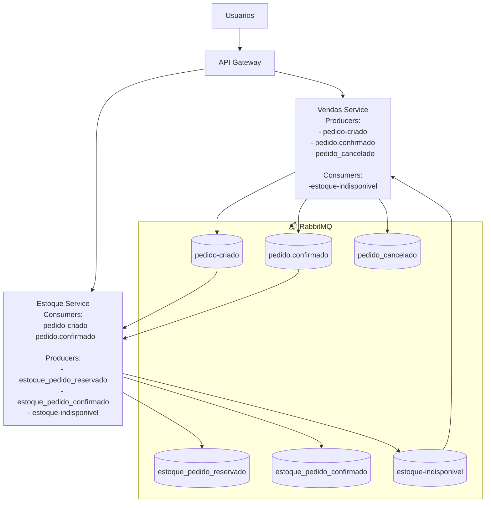

# Desafio Técnico - Microserviços E-commerce

[](https://dotnet.microsoft.com/)
[](https://www.microsoft.com/pt-br/sql-server)
[](https://www.rabbitmq.com/)
[](https://www.docker.com/)

---

## Índice

- [1. Sobre o Projeto](#sobre) </br>
- [2. Tecnologias usadas](#tecnologias)
- [3. Como Executar](#como-executar)
- [4. Arquitetura](#arquitetura)
- [5. Componentes](#componentes)
- [6. API Endpoints](#api-endpoints)
- [7. RabbitMQ](#rabbitmq)
- [8. Documentação Adicional](#documentacao)

<a id="sobre"></a>

## ​1. Sobre o Projeto

Projeto foi construído como estudo e para um Desafio técnico da Avanade.
Trata-se de um Microserviços de Sistema de Estoque e Vendas com API Gateway. Esse projeto foi construído com as melhores práticas de arquitetura moderna utilizando Clean Architecture, CQRS, DDD e EDA. Esse projeto foi melhorado aos poucos com estudo e referências como Eshop da Microsoft.

### **Arquitetura Proposta**

- Microserviço 1 (Gestão de Estoque):
  Responsável por cadastrar produtos, controlar o estoque e fornecer informações sobre a quantidade disponível.

- Microserviço 2 (Gestão de Vendas):
  Responsável por gerenciar os pedidos e interagir com o serviço de estoque para verificar a disponibilidade de produtos ao realizar uma venda.

- API Gateway:
  Roteamento das requisições para os microserviços adequados. Este serviço atua como o ponto de entrada para todas as chamadas de API.

- RabbitMQ:
  Usado para comunicação assíncrona entre os microserviços, como notificações de vendas que impactam o estoque.

- Autenticação com JWT:
  Garantir que somente usuários autenticados possam realizar ações de vendas ou consultar o estoque.

#### **Funcionalidades Requeridas**

- **Microserviço 1 (Gestão de Estoque)**:

Cadastro de Produtos: Adicionar novos produtos com nome, descrição, preço e quantidade em estoque.

Consulta de Produtos: Permitir que o usuário consulte o catálogo de produtos e a quantidade disponível em estoque.

Atualização de Estoque: O estoque deve ser atualizado quando ocorrer uma venda (integração com o Microserviço de Vendas).

- **Microserviço 2 (Gestão de Vendas)**:

Criação de Pedidos: Permitir que o cliente faça um pedido de venda, com a validação do estoque antes de confirmar a compra.

Consulta de Pedidos: Permitir que o usuário consulte o status dos pedidos realizados.

Notificação de Venda: Quando um pedido for confirmado, o serviço de vendas deve notificar o serviço de estoque sobre a redução do estoque.

- **Comum aos dois microserviços**:

Autenticação via JWT: Apenas usuários autenticados podem interagir com os sistemas de vendas ou consultar o estoque.

API Gateway: Usar um gateway para centralizar o acesso à API, garantindo que as requisições sejam direcionadas ao microserviço correto

<a id="tecnologias"></a>

## 2. Tecnologias usadas

- **Backend Framework**:

  - `.NET (8.0)`: Plataforma utilizada para construir toda a aplicação backend, aproveitando os recursos modernos da linguagem e do runtime.
  - `ASP.NET Core`: Framework utilizado para criação das APIs, permitindo alto desempenho, modularidade e extensibilidade.
  - `Entity Framework Core`: ORM utilizado para facilitar o mapeamento objeto-relacional e abstrair interações com o banco de dados.
  - `EF Core Tools & EF Core Design`: Ferramentas usadas para gerenciar migrações, scaffolding, design-time e outras funcionalidades do Entity Framework.
  - `MediatR`: Biblioteca utilizada para implementar o padrão CQRS, promovendo desacoplamento entre camadas e facilitando manutenção e testes.

- **Banco de Dados**:

  - `SQL Server`: Banco de dados relacional utilizado para persistência das informações de estoque, vendas e identidade.

- **Mensageria**:

  - `RabbitMQ 3.13`: Utilizado como broker de mensagens para comunicação assíncrona entre os microserviços, garantindo desacoplamento, resiliência e processamento orientado a eventos.

- **Authenticação e Segurança**

  - `JWT Bearer Authentication`: Utilizado para autenticação e autorização baseada em tokens de forma segura e escalável.
  - `PasswordHasher`: Recomendado pela Microsoft, É Utilizado para realizar o hashing seguro das senhas de usuários, seguindo boas práticas de segurança adotadas pelo ASP.NET Core Identity.

- **API Gateway**

  - `YARP (Reverse Proxy)`: Utilizado no API Gateway para roteamento e agregação de chamadas aos microserviços.

- **Logs & Monitoramento** ** Em progresso **

- **Documentação & Testes**

  - `Swagger / OpenAPI`: Utilizado para documentação e testes interativos das APIs durante o desenvolvimento.
  - `xUnit`: Framework de testes utilizado para implementação dos testes unitários do domínio e da aplicação.
  - `Moq` - Mocking para testes

- **Containerização**

  - `Docker` - Containerização
  - `Docker Compose` - Orquestração local para RabbitMQ e SQLServer

<a id="como-executar"></a>

## 3. Como Executar

### Pré-requisitos

Certifique-se de ter instalado:  
 [.NET 8 SDK](https://dotnet.microsoft.com/download/dotnet/8.0)  
 [Docker Desktop](https://www.docker.com/products/docker-desktop) (recomendado)

```bash
# 1 Clone o repositório

git clone <repository-url>
cd Avanade-Microservices

# 2. Inicie os containers (SQL Server + RabbitMQ)

Certifique de estar com o Docker aberto
docker-compose up -d

# 3. Execute o build de inicialização completa

Na pasta Avanade-Microservices
dotnet build


# 4. Para start a aplicação

- Certifique-se de que o SQL Server no docker está rodando e o RabbitMQ
- Não esqueça também que para startar é preciso entrar na pasta API de cada serviço e startar
- Ao startar o projeto vai fazer a atualização das migrations automaticamente.
  cd <Em uma pasta>/api
  abra outro terminal
  cd <EmOutraPasta>/api
  abra outro terminal
  cd <EmOutraPasta>/api
```

<a id="arquitetura"></a>

## 4. Arquitetura

### Diagrama da Arquitetura



---

### Fluxo de Comunicação

** Usuarios(Clientes)** → Autentica via **API Gateway**
** API Gateway(Yarp)** → Roteia requisições para microserviços
** Comunicação assíncrona** Comunicação Assíncrona entre serviços via RabbitMQ

1️⃣ Fluxo: Criação do Pedido

** Vendas Service**

- Cria o pedido inicial

- Publica o evento pedido-criado no RabbitMQ

** Estoque Service**

- Consome o evento pedido-criado

- Valida disponibilidade de estoque

- Atualiza QuantidadeReservada

- Se o estoque for insuficiente, publica estoque-indisponivel

**Vendas Service**

- Consome estoque-indisponivel

- Atualiza o status do pedido para "cancelado"

2️⃣ Fluxo: Confirmação do Pedido

Vendas Service

Após validação bem-sucedida do estoque

Atualiza o pedido para status Confirmado

Publica o evento pedido-confirmado

Estoque Service

Consome pedido-confirmado

Atualiza o estoque final (baixa definitiva)

<a id="componentes"></a>

## 5. Componentes

### API Gateway

- **Responsabilidade**: Ponto de entrada único, autenticação, roteamento
- **Porta**: 5035
- **Funcionalidades**:
  Autenticação JWT
  Crud de Usuarios
  Roteamento via YARP
  Swagger UI
  Swagger com multiplos documentos

### Estoque Service

- **Responsabilidade**: Gerenciamento de produtos e estoque
- **Porta**: 5285
- **Funcionalidades**:
  CRUD de produtos
  Controle de estoque
  Validação de disponibilidade
  Publicação de Eventos RabbitMQ
  Consumo de mensagens RabbitMQ
  Swagger
  Testes

- **Em progresso e em estudo**
  Logs estruturados (Serilog)

### Vendas Service

- **Responsabilidade**: Gerenciamento de vendas e pedidos
- **Porta**: 5156
- **Funcionalidades**:
  CRUD de pedidos
  Cálculo de totais
  Publicação de eventos RabbitMQ
  Consumo de mensagens RabbitMQ
  Swagger
  Testes

- **Em progresso e em estudo**
  Logs estruturados (Serilog)

### Verificação da Instalação

Após a execução, verifique se os serviços estão rodando:

| Serviço                 | URL                                                               | Status |
| ----------------------- | ----------------------------------------------------------------- | ------ |
| **Gateway**             | http://localhost:5038/swagger                                     | ✅     |
| **Gateway**             | http://localhost:5038/swagger/index.html?urls.primaryName=Vendas  | ✅     |
| **Gateway**             | http://localhost:5038/swagger/index.html?urls.primaryName=Estoque | ✅     |
| **Estoque Service**     | http://localhost:5285/swagger                                     | ✅     |
| **Vendas Service**      | http://localhost:5156/swagger                                     | ✅     |
| **RabbitMQ Management** | http://localhost:15672                                            | ✅     |

**Credenciais:**

- **RabbitMQ**: `guest` / `guest`

---

<a id="api-endpoints"></a>

## 6. API Endpoints {#api-endpoints}

### Autenticação

Pelo Swagger do Gateway você consegue registrar e fazer login e receber o token para acessar outras rotas

#### POST `/api/usuarios/login`

```json
{
  "email": "admin@hotmail.com",
  "password": "admin123"
}
```

**Resposta:**

```json
{
  "token": "eyJhbGciOiJIUzI1NiIsInR5cCI6IkpXVCJ9..."
}
```

#### POST `/api/usuarios/register`

```json
{
  "name": "string",
  "email": "string@hotmail.com",
  "role": "user",
  "password": "string"
}
```

<a id="rabbitmq"></a>

## 7. RabbitMQ

### Configuração

#### **Conexão:**

- **Host**: `localhost`
- **Porta AMQP**: `15672`
- **Management UI**: `15672`
- **Usuário**: `guest`
- **Senha**: `guest`

### Fluxo de Mensagens

#### ** Cliente cria pedido** → Vendas Service

- ** Vendas Service** → Persiste pedido no banco
- ** Vendas Service**→ Publica mensagem na fila pedido-criado
- ** Estoque Service** → Consome pedido-criado
- ** Estoque Service** → Verifica e reserva estoque

#### ** Se o estoque estiver indisponível**

- **Estoque Service** → Publica estoque-indisponivel
- **Vendas Service** → Consome estoque-indisponivel
- **Vendas Service** → Atualiza pedido para “Cancelado”

#### ** Fluxo de Confirmação**

- **Vendas Service** → Confirma pedido
- **Vendas Service** → Publica pedido.confirmado
- **Estoque Service** → Consome pedido.confirmado
- **Estoque Service** → Baixa estoque definitivo
- **Vendas Service** → Finaliza o pedido

#### Interface Web:

- **URL**: http://localhost:15672
- **Login**: guest / guest
- Navegue para **Queues** → Selecione fila → **Get messages**

---

<a id="documentacao"></a>

## 8. Documentação Adicional

Se você tem interesse em contribuir ou se deseja ajudar a melhorar o projeto, fique à vontade para enviar um pull request!
